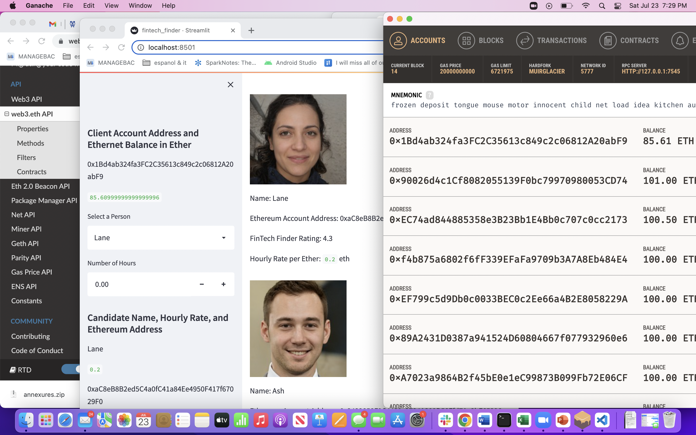
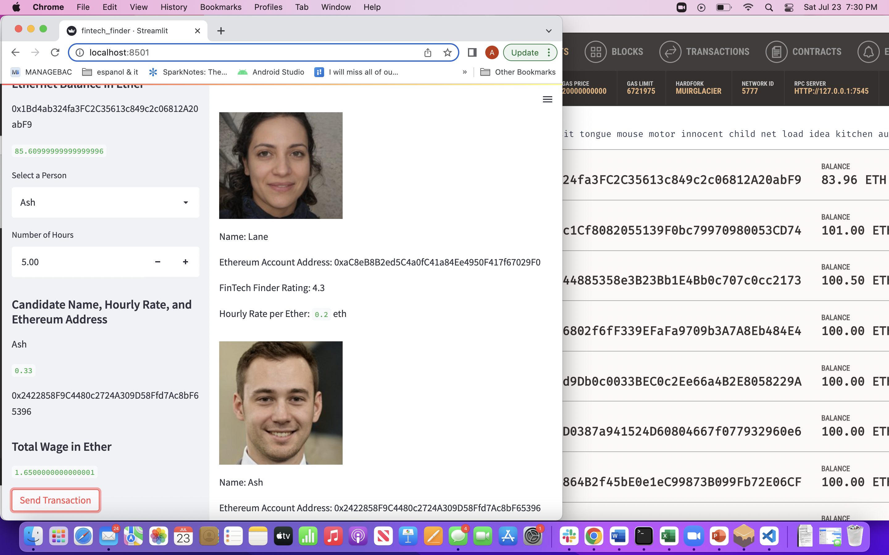
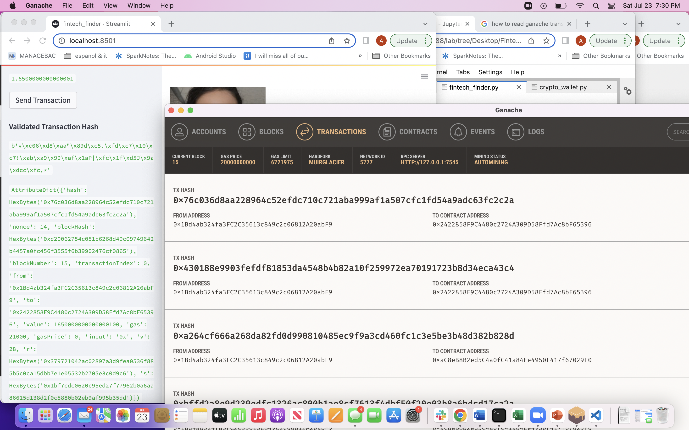

# Module-19-Challenge - Fintech Professional Services Payments System using Digital Wallets on Ethereum Blockchain
--- 

---
## User Story
You work at a startup that is building a new and disruptive platform called Fintech Finder. Fintech Finder is an application that its customers can use to find fintech professionals from among a list of candidates, hire them, and pay them. As Fintech Finder’s lead developer, you have been tasked with integrating the Ethereum blockchain network into the application in order to enable your customers to instantly pay the fintech professionals whom they hire with cryptocurrency.

The Starter Code was provided to expedite the development process.

---
---
## Acceptance Criteria  

The `Starter Code` for the Fintech Finder application must be modified to meet the following criteria:
* Import the transaction functions from `crypto_wallet` library in the main `fintech_finder.py` app, which is Streamlit based
* Sign and Execute the Payment transaction
* Verify the Transaction using Ganache Transaction log

---
---
## The Application

The Starter code was modified to:
* import the following transaction functions from `crypto_wallet`
    - `generate_account`
    - `get_balance`
    - `send_transaction`
            
* sign and execute a payment transaction 
    - calculate the `wage`s earned based upon the `hourly_rate` in the database and `hours` worked that is input
    - construct and send the transaction as follows:
        - set the gas price strategy to `medium_gas_price_strategy`
        - convert the wages in `Ether` to `Wei`
        - calculate gas estimate
        - construct a raw transaction using
            - sender address
            - receiver address
            - amount
            - gas estimate
            - gas price
            - nonce set to `getTransactionCount(account.address)`
* save and display the `transaction_hash`. Modified the code to further include displaying the entire transaction to facilitate ease of verification

## Inspect the Transaction
After running the application, it returned a `transaction_hash` upon successful sending of the payment to the chosen candidate. This `transaction_hash` was compared with the hash in Ganache Transaction log as shown.
            
### Before the Transaction
Notice the Balances on both the App and Ganache screens at **Eth 85.61**

### After the Transaction
After paying **Eth 1.65** see the balance on Ganache Log reduced to **Eth 83.96**

### Comparing with the Ganache Transaction Log

Look at transaction hashes starting with **0x76c** on both the App and Ganache Log.

---
---

## Technologies
The application is developed using:  
* Language: Python 3.7   
* Libraries: Pandas, Streamlit, web3, bip 44, mnemonic (bip 39)
* Development Environment: VS Code and Terminal, Anaconda 2.1.1 with conda 4.11.0, Jupyterlab 3.2.9
* OS: Mac OS 12.1

---
---

## Installation Guide
Before running the applications open your terminal to install the libraries and verify them. The following are instructions to install the libraries for the applications.  

* [python](https://www.python.org/downloads/) 
* [anaconda3](https://docs.anaconda.com/anaconda/install/windows/e) 
* [pandas](https://pandas.pydata.org/docs/getting_started/install.html)
* [streamlit](https://docs.streamlit.io/library/get-started/installation)
* [Ganache](https://trufflesuite.com/ganache/)

### Clone the application code from Github as follows:
copy the URL link of the application from its Github repository      
open the Terminal window and clone as follows:  

   1. %cd to_your_preferred_directory_where_you want_to_store_this_application  
    
   2. %git clone URL_link_that_was_copied_in_step_1_above   
    
   3. %ls       
        Module-19    
        
   4. %cd Module-19  

The entire application files in the current directory are as follows:

* Images              (screenshots used in README)
    - after_txn.png
    - ash.jpeg
    - before_txn.png
    - jo.jpeg
    - kendall.jpeg
    - lane.jpeg
    - verify_txn.png   
* README.md
* Starter_Code         (Starter Code)
* crypto_wallet.py     (Transaction functions library)
* fintech_finder.py    (main application code in Streamlit)
* my.env

**NOTE** `my.env` has Ganache provided mnemonic phrase. You should change it to use the mnemonic code you get when you run Ganache. 

---
---

## Usage
The following details the instructions on how to run the applications.  

### Setup the environment and Run the application 

Setup the environment using conda as follows:

    5. %conda create dev -python=3.7 anaconda  
    
    6. %conda activate dev  
    
### Setup Streamlit and Ganache
Before running the app,make sure the following are installed:
* Streamlit 
* all the libraries mentioned above
* Ganache

### Run the App

After step 6 of setting up the environment, follow these instructions:
    
     7. pipenv install streamlit
     8. Run Ganache in a sperate window and copy the mnemonic from the Accounts screen 
     9. save `MNEMONIC` from step8 above in `my.env` 
     10. streamlit run fintech_finder.py
     
Follow the prompts to enter the user inputs, and verify the transaction using the Ganache transaction logs

---
---

## Contributors 
Ashok Pandey - ashok.pragati@gmail.com, www.linkedin.com/in/ashok-pandey-a7201237  

---
---

## License
The source code is the property of the developer. The users can copy and use the code freely but the developer is not responsible for any liability arising out of the code and its derivatives.

---
---
